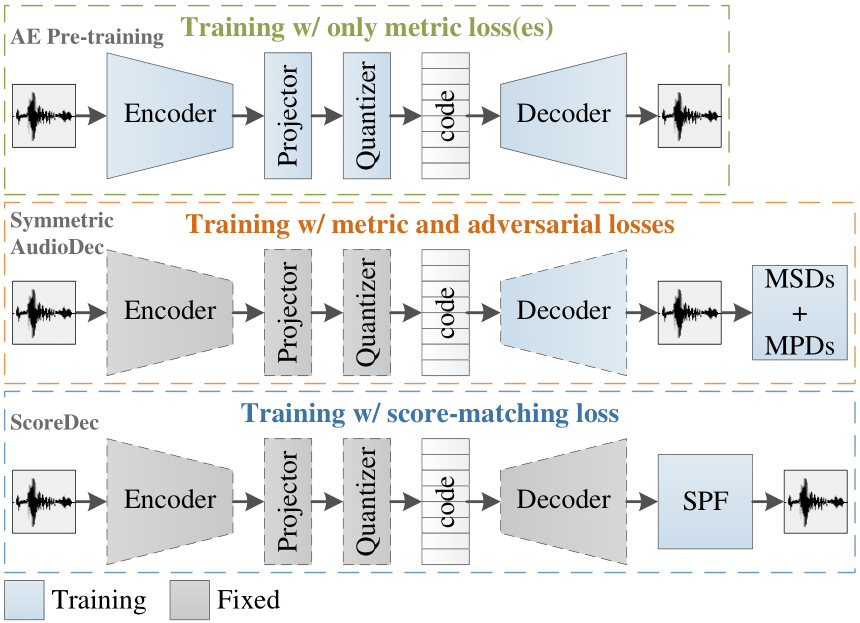
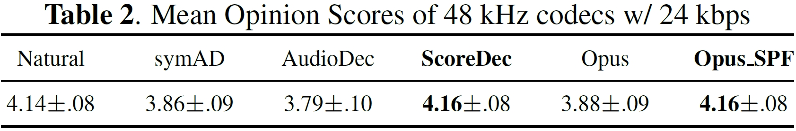
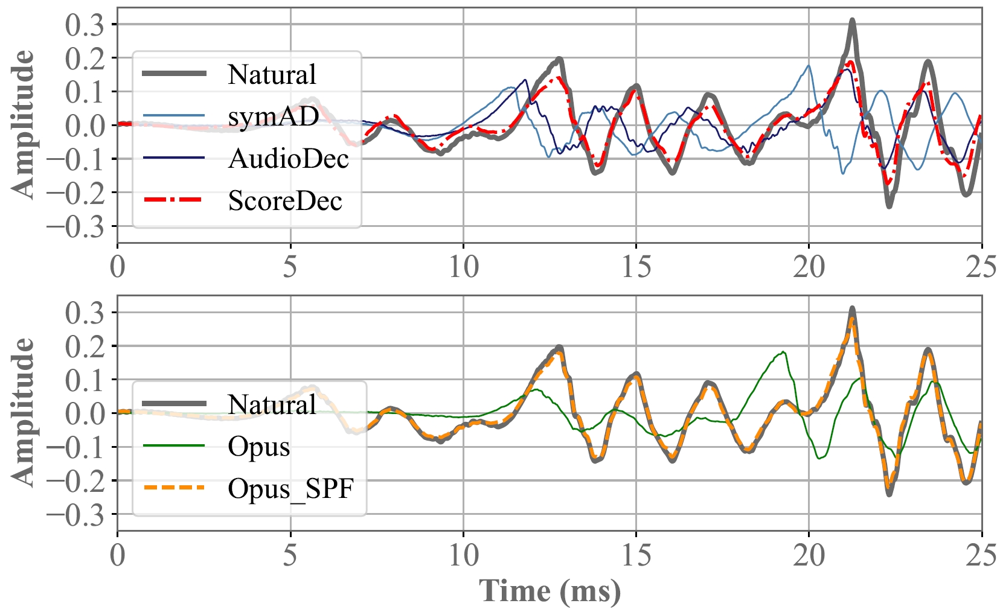

# ScoreDec: A Phase-preserving High-Fidelity Audio Codec with A Generalized Score-based Diffusion Post-filter

<I> Yi-Chiao Wu, Dejan Marković, Steven Krenn, Israel D. Gebru, and Alexander Richard </I>
 

 Meta Reality Labs Research, USA 
   

This page is the demo of ScoreDec [[paper](https://arxiv.org/abs/2401.12160)]

## **Abstract**  

 Although recent mainstream waveform-domain end-to-end (E2E) neural audio codecs achieve impressive coded audio quality with a very low bitrate, the quality gap between the coded and natural audio is still significant. A generative adversarial network (GAN) training is usually required for these E2E neural codecs because of the difficulty of direct phase modeling. However, such adversarial learning hinders these codecs from preserving the original phase information. To achieve human-level naturalness with a reasonable bitrate, preserve the original phase, and get rid of the tricky and opaque GAN training, we develop a score-based diffusion post-filter (SPF) in the complex spectral domain and combine our previous AudioDec with the SPF to propose ScoreDec, which can be trained using only spectral and score-matching losses. Both the objective and subjective experimental results show that ScoreDec with a 24 kbps bitrate encodes and decodes full-band 48 kHz speech with human-level naturalness and well-preserved phase information. 

## **Architecture**  

## **Demo Sounds**
- VCTK (*fs*: 48 kHz) (codec bitrate: 24 kbps)

| Codec | Male (p232_005) | Female (p257_016) |
|:--|:--:|:--:|
| Natural | <audio src="res/audio/vctk48k_male/Natural/2.wav" controls preload></audio> | <audio src="res/audio/vctk48k_female/Natural/17.wav" controls preload></audio> |
| symAD | <audio src="res/audio/vctk48k_male/symAD/2.wav" controls preload></audio> | <audio src="res/audio/vctk48k_female/symAD/17.wav" controls preload></audio> |
| AudioDec | <audio src="res/audio/vctk48k_male/AD/2.wav" controls preload></audio>   | <audio src="res/audio/vctk48k_female/AD/17.wav" controls preload></audio>   |
| **ScoreDec** | <audio src="res/audio/vctk48k_male/SD/2.wav" controls preload></audio>   | <audio src="res/audio/vctk48k_female/SD/17.wav" controls preload></audio>   |
| Opus | <audio src="res/audio/vctk48k_male/Opus/2.wav" controls preload></audio>   | <audio src="res/audio/vctk48k_female/Opus/17.wav" controls preload></audio>   |
| **Opus_SPF** | <audio src="res/audio/vctk48k_male/Opus_SPF/2.wav" controls preload></audio>   | <audio src="res/audio/vctk48k_female/Opus_SPF/17.wav" controls preload></audio>   |

| Codec | Male (p232_007) | Female (p257_080) |
|:--|:--:|:--:|
| Natural | <audio src="res/audio/vctk48k_male/Natural/3.wav" controls preload></audio> | <audio src="res/audio/vctk48k_female/Natural/21.wav" controls preload></audio> |
| symAD | <audio src="res/audio/vctk48k_male/symAD/3.wav" controls preload></audio> | <audio src="res/audio/vctk48k_female/symAD/21.wav" controls preload></audio> |
| AudioDec | <audio src="res/audio/vctk48k_male/AD/3.wav" controls preload></audio>   | <audio src="res/audio/vctk48k_female/AD/21.wav" controls preload></audio>   |
| **ScoreDec** | <audio src="res/audio/vctk48k_male/SD/3.wav" controls preload></audio>   | <audio src="res/audio/vctk48k_female/SD/21.wav" controls preload></audio>   |
| Opus | <audio src="res/audio/vctk48k_male/Opus/3.wav" controls preload></audio>   | <audio src="res/audio/vctk48k_female/Opus/21.wav" controls preload></audio>   |
| **Opus_SPF** | <audio src="res/audio/vctk48k_male/Opus_SPF/3.wav" controls preload></audio>   | <audio src="res/audio/vctk48k_female/Opus_SPF/21.wav" controls preload></audio>   |

symAD: `symmetric AudioDec`   
AudioDec: `AudioDec (w/ multi-group HiFi-GAN vocoder)`   
**ScoreDec**: `the proposed ScoreDec`   
Opus: `Opus w/ 24kbps for mono audio`   
**Opus_SPF**: `the proposed score-based post-filter combined with Opus`   

## **Speech Quality Measurments** 

  

## **Waveform Similarity Comparison** 

##  Liability Disclaimer

The demo page utilizes a public speech dataset (<a href="https://datashare.ed.ac.uk/handle/10283/3443">VCTK</a>) for demonstration purposes only, and we do not claim ownership over these speech samples. The Content of the demo files is provided "as is" and for general informational purposes only. We make no warranties regarding its accuracy or suitability. If you believe that any speech samples infringe upon your rights or violate any laws, please contact us to remove the demo files. We are not liable for any damages arising from the use or reliance on our demo page or open-source code. By accessing the demo page, you agree to release us from any claims or liabilities related to its use. 

  

[Home](https://bigpon.github.io/)

   
 